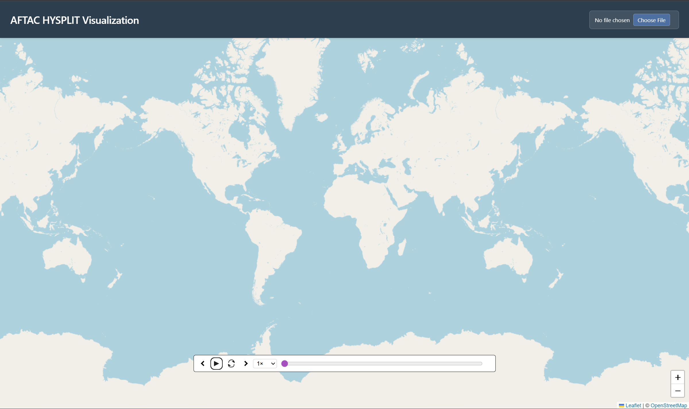
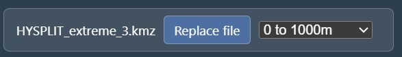
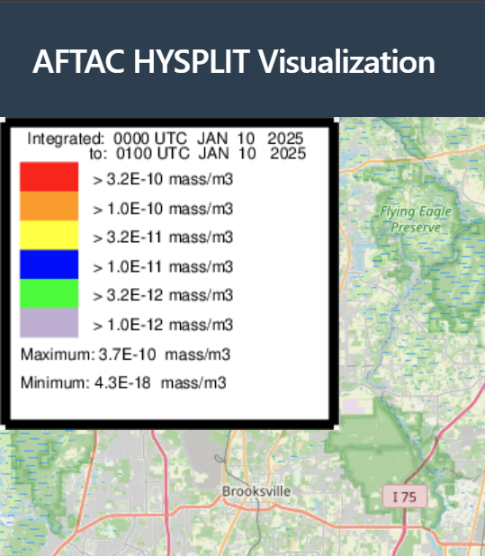

# AFTAC-HYSPLIT KMZ Visualizer
## Table of Contents
* [Description](#description)
* [Features](#features)
* [Requirements](#requirements)
* [External Dependencies](#external-dependencies)
* [Environment Secrets](#environment-secrets)
* [Installation and Setup](#installation-and-setup)
* [Usage](#usage)
* [Documentation](#documentation)
* [Deployment](#deployment)
* [Credits and Acknowledgements](#credits-and-acknowledgements)
* [Third Party Libraries](#third-party-libraries)
* [Contact Information](#contact-information)

## Description
AFTAC-HYSPLIT KMZ Visualizer is a visualization software for KMZ files made specifically for outputs of the AFTAC (Air Force Technical Applications Center) HYSPLIT projective model.
It is meant to track and display nuclear plumes in a well-supported, user-friendly way.
Compared to other available KMZ/GIS visualizers ([ArcGIS](https://www.arcgis.com/index.html), [Google Earth](https://earth.google.com/web/), [QGIS](https://qgis.org/)), our application is well-tested, actively supported, and made with analyst use in mind for their specific use cases.

## Features
### KMZ Loading/Parsing
KMZ files are the only files accepted, and the associated KML and non-KML files are extracted and parsed. Any errors during this process is logged to the user. Additionally, if multiple KML Documents are detected, each are separated and selectable in a dropdown menu.
### Interactive Map Display
Panning, zooming, and other intuitive map controls, as implemented by LeafletJS.
### Legends/Screen Overlays
Parsing and display of image data as ScreenOverlays. Most useful for pictoral legends and watermarks.
### Timeline Scrubber
Input for scrolling through time as a input slider or directional buttons to display the time-span based data. Also has animation playback with pausing, looping, and playback speed controls.

## Requirements
This code has been run and tested using the following internal and external components

Environment:
- Windows 11 (development)
- RedHat Linux 8 (deployment)

Program:
- TypeScript
- Svelte 5

Tools:
- Git Hub
- Vite
- Vitest
- VSCode
- Zed

## External Dependencies
- **NodeJS**: Download version 22.22.0 LTS at https://nodejs.org/en/download
- **Git**: Download the latest version at https://git-scm.com/book/en/v2/Getting-Started-Installing-Git
- **GitHub Desktop** (Not needed, but HELPFUL): at https://desktop.github.com/

## Environment Secrets
No environment variables are required for the application.

## Installation and Setup
Ensure you have downloaded and installed NodeJS from the above link.

Download this code repository by using git:

```
$ git clone https://github.com/haileytrinh/AFTAC-HYSPLIT.git
```

Run the following code in Powershell if using Windows or the terminal using Linux/Mac:
```
$ cd AFTAC-HYSPLIT
```

Install the app:
```
$ npm install
```

Run the app:
```
npm run dev
```


The application can be seen using a browser and navigating to http://localhost:5173/, or the link shown in the terminal.


## Usage
To visualize a KMZ, first ensure that the KMZ is downloaded locally onto your machine.
Then, open the AFTAC-HYSPLIT KMZ Visualizer. It will open to the interactive map display, which can be used to explore the world.
To move the map, click and drag. To zoom, scroll.



To upload the KMZ, press the import button in the top right. If another KMZ needs to be visualized, press the Replace File button, which takes the place of the import button.


If the KMZ has multiple nested Documents, they will be detected and aggregated into a dropdown to display individually.



The KMZ will automatically parse and load the first timestamp (chronologically). The map will pan and zoom on the data as well.
Any ScreenOverlays, such as legends, will also automatically parse and display.



The Timeline Scrubber can be used to move through the timestamps. There are multiple ways to do so:


The purple slider can be clicked and dragged to move through time. Additionally, the right and left arrows can step through one time stamp at a time.
The play button will start the animation playback. This can be paused by pressing the same button. By default, the animation will stop upon reaching the last timestamp.
The scrubber can be set to loop by toggling the loop button. This can be reset to stop at the end by pressing it again.
The speed of the animation can be modified with the timescale dropdown, with options of 0.5x, 1x, 2x, and 4x speed.


## Documentation
Important Documentations to know of:
- KML Reference (how the KML file structure/tags work): https://developers.google.com/kml/documentation/kmlreference
- Svelte Documentation (how to use Svelte for the site itself): https://svelte.dev/docs/svelte/overview
- Leaflet Documentation (how to use Leaflet for the interactive map): https://leafletjs.com/reference.html
- Vitest Documentation (how to use the Vitest testing library): https://vitest.dev/api/test

## Deployment
The project is meant to be deployed on a small Linux VM in AFTAC's private network. To faciliate this, the project can be compiled to a static site and served using a simple python webserver. AFTAC employees can then local port forward to access the webserver and site through their own browser.

First, ensure you are in the root directory (`/AFTAC-HYSPLIT`), on the main branch, and are up to date with any changes:
```
$ git switch main
$ git pull
```

Once pulled, build the project using Vite:
```
$ npm run build
```

This will compile the project into a `/dist` directory in the same directory you are in. 
Compress the whole `/dist` director and all its contents into a zip/tarball.

Then, send the packaged build to AFTAC.
Once on the AFTAC servers, simply un-compress the `/dist` folder and run the following:
```
$ python -m http.server [port number]
```
Where `[port number]` is the networking port to expose (8080 is a good choice).

From there, AFTAC analysts can access the site with a local port forward:
```
$ ssh -L [local port]:localhost:[web server port] [user]@[ip address]
```
Where `[local port]` is the networking port on the local machine to use, `[web server port]` is the port number from above (likely 8080), and `[user]` and `[ip address]` are the necessary credientials to access the Linux VM.

Going to http://localhost:[local port] will access the deployed product.

## Credits and Acknowledgements
This project was created by the AFTAC-HYSPLIT Capstone Team, which includes:
- Reeve Baker
- Alexey Bobkov
- Duncan Redheendran
- Hailey Trinh
- Adam Vasquez

Special thanks to our Capstone Professor and TA
- Pauline Wade
- Brady Testa

And our AFTAC Mentor
- Dylan Card

## License
This project is licensed under the MIT License - see the [LICENSE](LICENSE) file for details.

## Third-Party Libraries
This project uses the following third-party libraries:
- [LeafletJS](https://leafletjs.com/) for the interactive map display (BSD-2 Clause License)
- [JSZip](https://stuk.github.io/jszip/) for unzipping KMZ files (MIT License)

## Contact Information
Any questions, contact information is below.
<REPLACE WITH PROJECT MAINTAINER>
